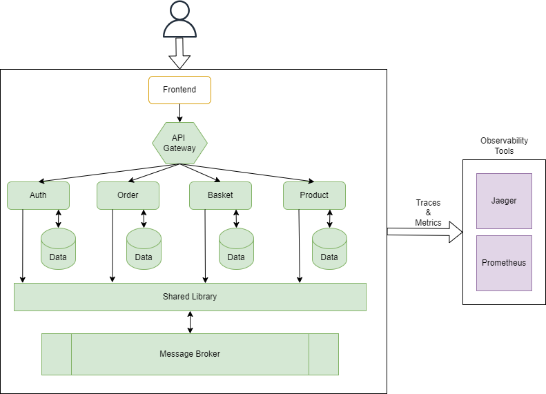

# **Microservicios con .NET 8**

Este proyecto no se crea para enseñar nada, sino para aprender y no hay mejor forma de aprender que con la práctica (crear para crecer). Es un ejemplo simple pero a la vez completo al tocar bastantes puntos de lo que puede ser un proyecto real de microservicios: 

* Microservicios en proyectos basket, order, product y auth con .NET 8 y Minimal APIs.
* Proyecto shared con biblioteca de código compartido para Nuget.
* Proyecto api-gateway para un API-Gateway con Ocelot
* Comunicación entre microservicios con RabbitMQ.
* Almacenamiento con SQL Server, MongoDB y Redis (cache).
* Observabilidad con Opentelemetry (Prometeus, Zipkin, Loki, Jaeger y Grafana).
* Autenticación y autorización de microservicios con JWT.
* Uso de contenedores docker.
* Resiliencia de microservicios y almacenamiento.
 (De momento dejo pendiente la resiliencia de RabbitMQ con el paquete Polly.Core y eventos fallidos con el patrón Outbox para cuando tenga algo de tiempo, ya que acabo de adentrarme en el mundo de Machine Learning y Ciencia de Datos con un curso que promete, aunque muy largo....)

  

  
  
  

 

## Enlace a guia de referencia

[Agradecimientos a code-maze.com](https://code-maze.com/)

